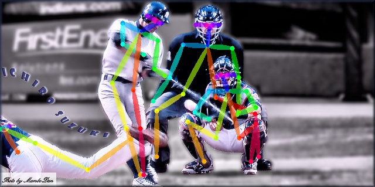

# SamyleePoseApi-OpenLibrary
GPU Real-time PoseApi (**Windows only**, Open Library)

# Documentation
## requirements
* NVIDIA-GPU (GTX1080/1080Ti, RTX2080/2080Ti)
* Windows10/7
* VC14.1/15 (VS2017 or higher)
* [third_part_dll](https://pan.baidu.com/s/12OXitndIZf-s8gWs2kl1jw) (Password: `izy2`)

## Algorithm efficiency
|Algorithm|mAP|Speed/FPS|model|CPU/GPU|
|:------:|:------:|:------:|:------:|:------:|
|[OpenPose](https://github.com/CMU-Perceptual-Computing-Lab/openpose)|0.61|70ms/14FPS|---|i7-9700K/GTX1080|
|[YOLOV3-SPP](https://github.com/pjreddie/darknet) + SamyleePoseApi|**0.72**|**50ms/20FPS**|[weights](https://pan.baidu.com/s/1DtfEOWKll4EsI-K9n7yd0A)(Password: `rg7w`)|i7-9700K/GTX1080 |

# Example result
  

# Reference
https://blog.csdn.net/samylee
https://github.com/MVIG-SJTU/AlphaPose
